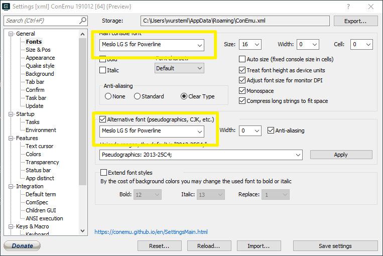

# Powerline

## Install the Fonts on Windows

* Go to the Powerline Fonts Github page: <https://github.com/powerline/fonts>
* Download and extract ZIP and 
* Open PowerShell as an Administrator
* Enable execution of scripts: `Set-ExecutionPolicy Bypass`
* Install fonts: `.\install.ps1`
* Disable execution of scripts: `Set-ExecutionPolicy Default`

## Git Bash Powerline Theme

<https://github.com/diesire/git_bash_windows_powerline>

## Powershell for Windows Subsystem for Linux

```
sudo apt update
sudo apt upgrade
sudo apt-get install build-essential git python-pip
```

<https://github.com/b-ryan/powerline-shell>

## Powerline for PowerShell

Open PowerShell with administrative rights:

```
Set-ExecutionPolicy Bypass
Install-Module posh-git
Install-Module oh-my-posh
Install-Module Get-ChildItemColor
```

Open PowerShell profile (`code $PROFILE`) and add the following:

```
function U
{
    param
    (
        [int] $Code
    )
    if ((0 -le $Code) -and ($Code -le 0xFFFF))
    {
        return [char] $Code
    }
    if ((0x10000 -le $Code) -and ($Code -le 0x10FFFF))
    {
        return [char]::ConvertFromUtf32($Code)
    }
    throw "Invalid character code $Code"
}

Import-Module posh-git
Import-Module oh-my-posh
Set-Theme Paradox

Import-Module Get-ChildItemColor
Set-Alias l Get-ChildItemColor -Option AllScope
Set-Alias ll Get-ChildItemColor -Option AllScope
Set-Alias ls Get-ChildItemColorFormatWide -Option AllScope
Set-Alias dir Get-ChildItemColorFormatWide -Option AllScope

$DefaultUser = 'miwurster'
```

Apply the following settings for ConEmu:


